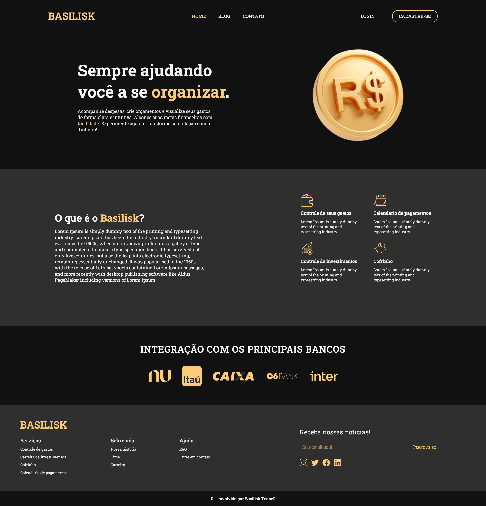
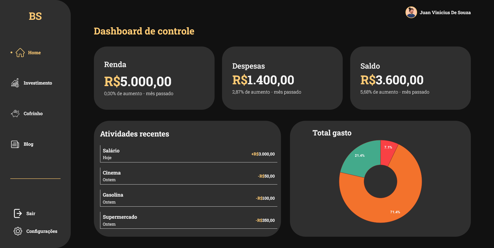
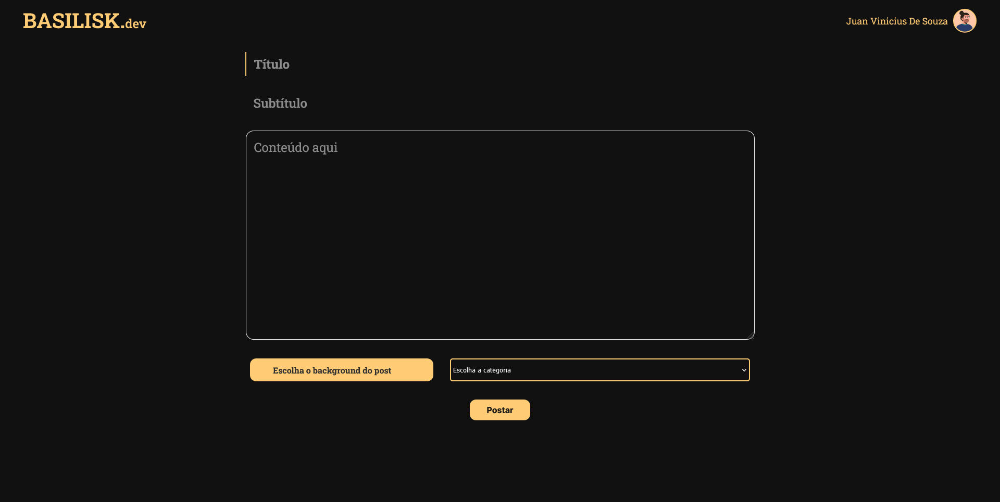

🚧Basilisk 🪙 Em Construção... 🚧 

## 💻 Sobre o projeto
---
O Basilisk é uma forma de ajudar o brasileiro a se organizar financeiramente oferecendo-lhe diversos recursos de economia e controle de suas despesas, sem precisar de nenhuma conexão com conta bancaria ou algo do tipo. 

Essa aplicação utiliza de recursos PHP e SQL aprendidos em aula, utilizando de softwares como VSCode como IDE, XAMPP para execução local do projeto e PhpMyAdmin como administrador de banco de dados MySQL.

*Projeto desenvolvido para o Projeto Integrador da faculdade **UniOpet**. Basilisk é um projeto que será desenvolvido por seus colaboradores mesmo após o termino do curso.*

---
## 🛠️ Tecnologias utilizadas

- [HTML](https://developer.mozilla.org/pt-BR/docs/Learn/HTML)
- [CSS](https://developer.mozilla.org/pt-BR/docs/Learn/CSS)
- [Sass](https://sass-lang.com)
- [Bootstrap](https://getbootstrap.com)
- [PHP](https://www.php.net)
- [JavaScript](https://developer.mozilla.org/pt-BR/docs/Web/JavaScript)
---
## ⚙️Funcionalidades
- O nosso cliente pode utilizar das seguintes funcionalidades: 
	- Dashboard de controle de gastos
	- Dashboard de controle de investimentos
	- Dashboard de controle de metas/cofrinho
		- Cliente informa o quanto deseja economizado e é feito mais duas propostas para o cliente analisar.
	- Blog com dicas de investimento	
- Já o desenvolvedor terá as seguintes funcionalidades:
	- Dashboard com dados sobre a aplicação
	- CMS feito em PHP para escrever matérias no blog
---
## 🎨Layout/Screenshots

---
## 📃Licença
Essa versão do projeto esta sobre a licença do [MIT](License.md).

## 🎓 Autores

- **Juan Vinicius** - [Linkedin](https://www.linkedin.com/in/juan-vinicius-dev/) - [Github](github.com/devjuanvinicius)
- **Leticia Eltermann** - [Linkedin](https://www.linkedin.com/in/leticia-eltermann-390974283/) - [Github](https://github.com/leticiael)
- **Clewerton Kaique** - [Linkedin](https://www.linkedin.com/in/clewerton-kaique-santos-silva-125a161b4/) - [Github](https://github.com/leticiael)
- **Leticia Marques** - [Linkedin](https://www.linkedin.com/in/letícia-marques-380690268/) - [Github](https://github.com/leticia-marques-a-p)
